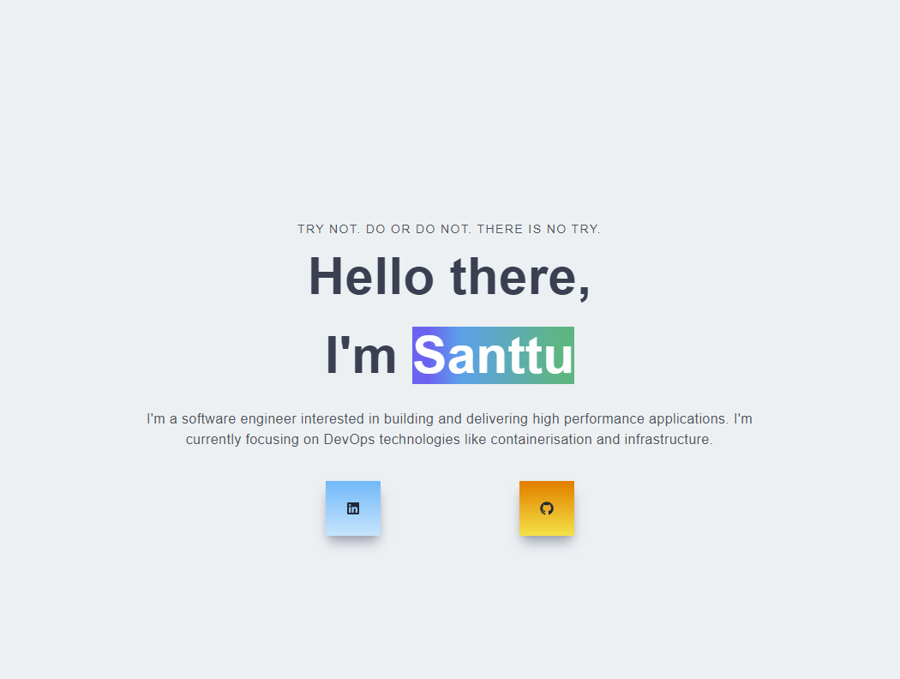

# DevOps Developer Portfolio

The goal of this project is to keep growing my Software Engineering skills by building, testing and debugging a web application. I am also learning different DevOps tools, like Docker, Kubernetes, Terraform and CI/CD pipelines.

## What is DevOps
DevOps is a cultural shift in Software Development bundled with practices and tools for organizations to deliver higher quality code faster. At a very base level DevOps is a continuation of Agile. The cultural shift ensures that employees inside organizations are aware of each others work and are able to collaborate more effortlessly. This means that developers can release code to production much faster without having to wait until the end of a sprint or having to wait for Operations to configure the infrastructure.

# The Web Application
Initially the idea was to build a simple web app and I had decided to go for a developer portfolio, since I didn't have one before. I chose to write the website with React using the Next framework and style it with Tailwind.

## Future of the website
Learning never stops. The point of a developer portfolio is to show your skills, at least visually. 
While I have to eventually update my skills, resume and projects, I also want to also try different layouts and color schemes for the website. 
 
 
A roadmap for this website
<ul>
    <li>A blog / Developer diary</li>
    <li>Metrics dashboard</li>
    <li>Dark/Light mode toggle</li>
</ul>

# Testing

# Setting a few goals:
<li>Set up a pipeline to merge changes</li>
<li>Automated testing</li>
<li>Storing artifact into Github Container Registry</li>
<li>Deploying to a CaaS like Azure Container Instances</li>
<li>Adding some metrics tracking</li>
